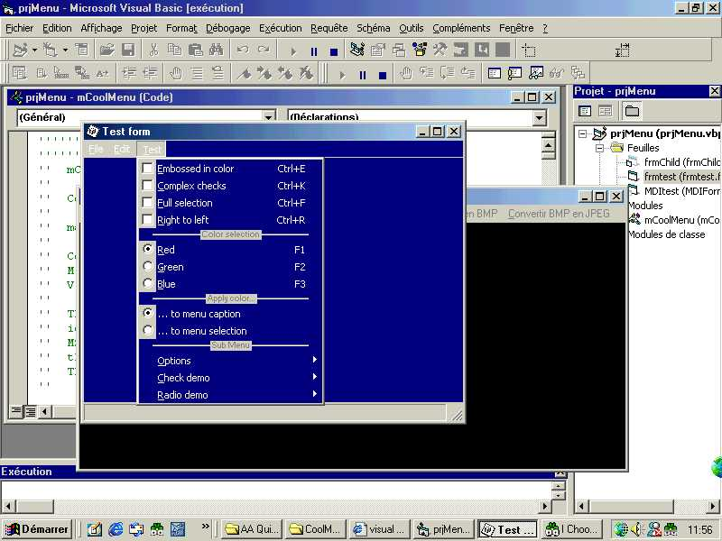

## Cool Menu 1\.4

### Description

This module allows an application to show

icons in Menus,Change ForeColor,BackColor

this is a new fix for the original Code Copyright Olivier Martin 2000...
 
### More Info
 

             |
---                |---
**Submitted On**   |2001-07-16 11:50:30
**By**             |[mini](https://github.com/Planet-Source-Code/PSCIndex/blob/master/ByAuthor/mini.md)
**Level**          |Intermediate
**User Rating**    |5.0 (15 globes from 3 users)
**Compatibility**  |VB 6\.0
**Category**       |[Complete Applications](https://github.com/Planet-Source-Code/PSCIndex/blob/master/ByCategory/complete-applications__1-27.md)
**World**          |[Visual Basic](https://github.com/Planet-Source-Code/PSCIndex/blob/master/ByWorld/visual-basic.md)
**Archive File**   |[Cool Menu 2295171720\.zip](https://github.com/Planet-Source-Code/mini-cool-menu-1-4__1-25127/archive/master.zip)

